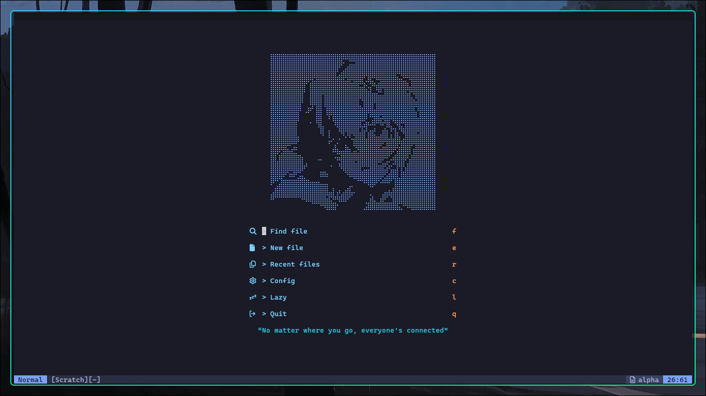
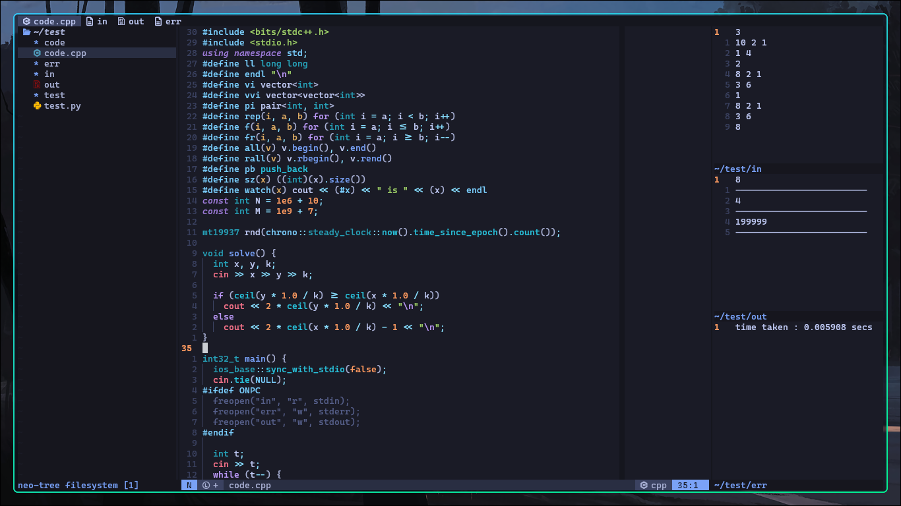
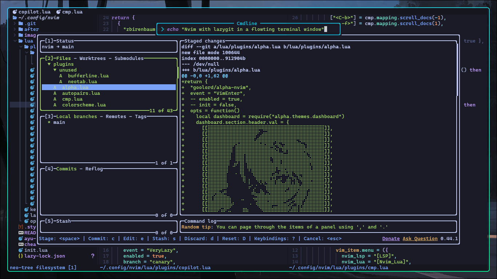

# NVIM Config

My personal nvim configuration, built on top of kickstart-nvim, adding stuff to suit my needs.

## Looks




## Installation
1. Backup your old nvim config if it exists
    ```sh
    mv ~/.config/nvim ~/.config/nvim.bak
    ```

2. Clone the repo
    ```sh
    mkdir ~/.config/nvim
    git clone https://github.com/ugly-custard/nvim.git ~/.config/nvim/
    ```

## Keybinds
Well, I'm too lazy to make a guide or cheatsheet. Just go through the lua/keymaps.lua for general keybinds, and then through each of the files in lua/plugins for plugin-specific binds. I'll make a cheatsheet one day, one day for sure.
